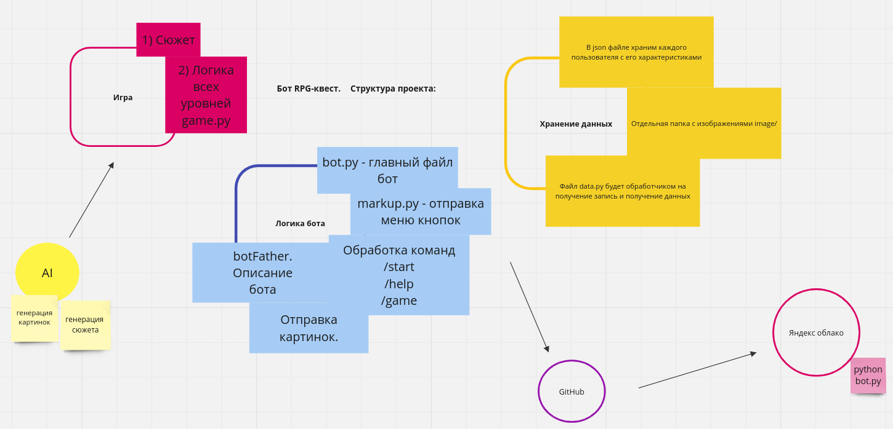

# Бот RPG-квест "Красная Сеть: За Гранью Марсианских Вершин"

**Сюжет:** 

В недалеком будущем человечество решает взять под свой контроль Красную Планету, строя на ней первую марсианскую колонию. Однако, когда колония сталкивается с загадочными аномалиями, вы, в роли талантливого инженера, отправляетесь решать проблемы и создавать свой собственный интернет на Марсе.  

## Об игре

Игрок начинает свое путешествие в главном городе колонии, где встречаются разнообразные персонажи — ученые, исследователи, и предприниматели. Ваша цель — создать эффективную марсианскую сеть, обеспечивая коммуникации и передачу данных между колониями, а также решая тайны аномалий, которые влияют на сетевую инфраструктуру.  

Локации включают в себя марсианские поселения, подпольные исследовательские лаборатории, поверхность Красной Планеты и подземные объекты. В процессе игры вы сталкиваетесь с вызовами вроде песчаных бурь, энергетических аномалий и инопланетных технологий.

Игроку предстоит строить инфраструктуру, управлять ресурсами, взаимодействовать с марсианскими обитателями и решать проблемы, чтобы создать стабильный и надежный интернет на Красной Планете.

**Цель игры**

Построить Красную Сеть, которая превратит Марс в новый центр человеческой активности в "Красной Сети: За Гранью Марсианских Вершин".

## Телеграм бот

Бот написан с использованием библиотеки pyTelegramBotAPI для работы с Телеграм.

### Создание бота через botFather

Описание бота в Телеграм устанавливается через BotFather.  

**Name:**  ⚡️ RedNetwork  

**About:** RPG-квест "Красной Сети: За Гранью Марсианских Вершин". Цель игры: построить Красную Сеть, которая превратит Марс в новый центр человеческой активности.  

**Description**: Бот RPG-квест "Красная Сеть: За Гранью Марсианских Вершин". Цель игры: Построить Красную Сеть, которая превратит Марс в новый центр человеческой активности в "Красной Сети: За Гранью Марсианских Вершин".

### Меню команд для бота

Меню команд бота:  
  - /start    - начало игры
  - /help     - раздел помощи
  - /contacts - раздел контактов

Меню команд создается в коде.

## Архитектура

## Основные функции бота 

1. Начало игры: 
  - Игра может запускаться несколькими пользователями одновременно.
  - При запуске бота игрок получает приветственное сообщение и предложение начать игру.  

2. Мир и локации:  

  - В игре 3 уровня. Первый уровень - начало игры. 
  - У каждой локации есть описание, иллюстрация, сгенерированная нейросетью, и список доступных действий.
  - Варианты ответа игрока представлены в виде кнопок.